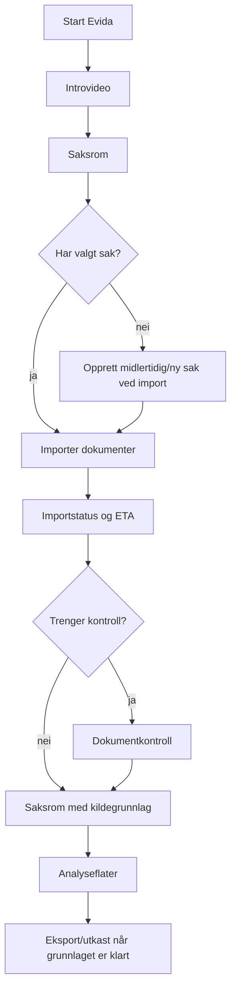

# 02 Produktflyt og brukerreise

## Nåværende hovedflyt



## Viktig endring

Det er ikke login i lokal evaluation-build.

Flyten er:

```text
introvideo -> app/Saksrom
```

Dette er implementert i:

```text
evida-core\desktop-tauri\src\App.tsx
```

Regresjonstester ligger i:

```text
evida-core\desktop-tauri\scripts\run-case-flow-tests.mjs
evida-core\desktop-tauri\scripts\run-smoke-path-tests.mjs
evida-core\desktop-tauri\scripts\run-phase-hardening-tests.mjs
```

## Første brukeropplevelse

1. Brukeren åpner `Start Evida.bat` eller `Evida.exe`.
2. Introvideoen vises fullskjerm i appvinduet.
3. Klikk på introen åpner Saksrom.
4. Hvis saken mangler dokumenter, vises en dokument-først tomtilstand.
5. Brukeren kan dra inn dokumenter eller bruke filvelger.
6. Importen viser konkret status, progresjon, ETA og hva som mangler.
7. Når kildegrunnlag finnes, kan Saksrom brukes med kildebevisste svar.

## Hva Saksrom skal føles som

Saksrom skal være en rolig juridisk arbeidsflate, ikke et teknisk dashboard.

Kjennetegn:

- chat først
- tydelig neste anbefalte handling
- kilder og usikkerhet synlig, men ikke dominerende
- import-/kontrollinformasjon plassert der brukeren trenger den
- ingen falsk "alt er klart" når dokumentgrunnlaget er ufullstendig

## Låsing og progresjon

Venstremenyen viser færre valg før dokumenter finnes. Flere arbeidsrom låses opp etter hvert:

- `Dokumenter` og `Saksrom` er basisflater
- `Dokumentkontroll` åpnes når dokumenter finnes
- analyseflater åpnes når readiness tilsier at saken kan analyseres
- utkast/eksport krever høyere readiness

Logikken ligger primært i:

```text
evida-core\desktop-tauri\src\components\Sidebar.tsx
evida-core\desktop-tauri\src\features\readiness\caseReadiness.ts
```

## Viktige manuelle røykstier

```text
intro -> Saksrom -> import -> kontroll -> Saksrom -> kilde -> analyseflate
```

og:

```text
ny sak -> dokumenter -> importstatus -> dokumentkontroll -> eksport
```
