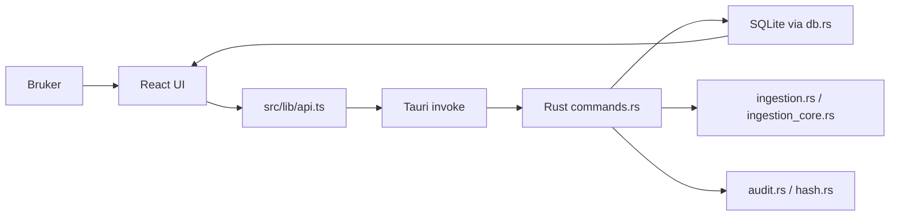

# 03 Arkitektur og kodekart

## Kortversjon

Evida desktop består av:

- React/TypeScript frontend
- Tauri shell
- Rust kommando- og datalag
- lokal SQLite database
- lokal dokumentimport og kildegrunnlag
- testskript som verifiserer produktkontrakter



## Aktiv kodebase

```text
evida-core\desktop-tauri
```

Viktigste undermapper:

```text
src/                  React, TypeScript, UI og frontendlogikk
src/components/       Delte UI-komponenter
src/components/workrooms/
src/features/         Domenelogikk for readiness, import UX, legal commands
src/lib/              API wrapper, shortcuts, parsing, answer quality
src/types/            Frontendtyper
src-tauri/src/        Rust/Tauri kommandoer, DB, import, audit
scripts/              Node-baserte kontraktstester
public/               logo og introvideo i bygget app
```

## React-innganger

```text
src/main.tsx
src/App.tsx
src/styles.css
```

`App.tsx` eier mye av apporkestreringen:

- onboarding/intro state
- aktiv sak
- aktiv visning
- importkø
- Saksrom-spørsmål
- dokumentkontroll
- modaler/drawers
- navigasjon mellom arbeidsrom

## Viktige UI-komponenter

```text
src/components/Sidebar.tsx
src/components/CaseRoomView.tsx
src/components/ImportProgressSummary.tsx
src/components/CaseHeader.tsx
src/components/CaseSwitcher.tsx
src/components/SourcePreviewDrawer.tsx
src/components/DocumentPreviewDrawer.tsx
src/components/settings/SettingsView.tsx
src/components/workrooms/*.tsx
```

## Domenelogikk i frontend

```text
src/features/documents/importUx.ts
```

Bestemmer importutfall, neste handling, ETA-synlighet og om Saksrom kan åpnes med begrenset eller fullt kildegrunnlag.

```text
src/features/documents/documentBasis.ts
```

Grupperer dokumenter i klare dokumenter, dokumenter som trenger kontroll, og dokumenter som ikke ble brukt.

```text
src/features/readiness/caseReadiness.ts
```

Bestemmer readiness-verdict for saken.

```text
src/features/legalCommands/legalCommands.ts
```

Tolker juridiske hurtigkommandoer.

```text
src/features/adaptiveSaksrom/
```

Støtter tone, arbeidsstatus, samtaleminne og foreslåtte handlinger i Saksrom.

## Frontend API-lag

```text
src/lib/api.ts
```

Dette er broen mellom React og Tauri. I Tauri-runtime kaller den Rust via `invoke`. I web/devmodus faller mange funksjoner tilbake til localStorage, slik at deler av appen kan testes i browser.

## Rust/Tauri

```text
src-tauri/src/lib.rs
src-tauri/src/commands.rs
src-tauri/src/db.rs
src-tauri/src/ingestion.rs
src-tauri/src/ingestion_core.rs
src-tauri/src/domain.rs
src-tauri/src/audit.rs
src-tauri/src/crypto.rs
src-tauri/src/hash.rs
src-tauri/src/db_key.rs
```

`lib.rs` registrerer Tauri-kommandoene.

`commands.rs` er offentlig kommandooverflate til frontend.

`db.rs` eier SQLite-skjema, queries og lokal datalagring.

`ingestion.rs` og `ingestion_core.rs` eier dokumentimport, tekstuttrekk, kildeobjekter og importstatus.

## Arkitekturgrenser

Canonical arkitektur står i:

```text
ARCHITECTURE.md
DECISIONS/
SECURITY.md
```

Viktigste grense:

- desktopappen eier lokal evaluation-opplevelse
- enterprise backend/control-plane skal på sikt eie tenant, bruker, rolle, lisens, policy og produksjonsautorisasjon
- lokal app er ikke en produksjonsautorisasjonskilde
