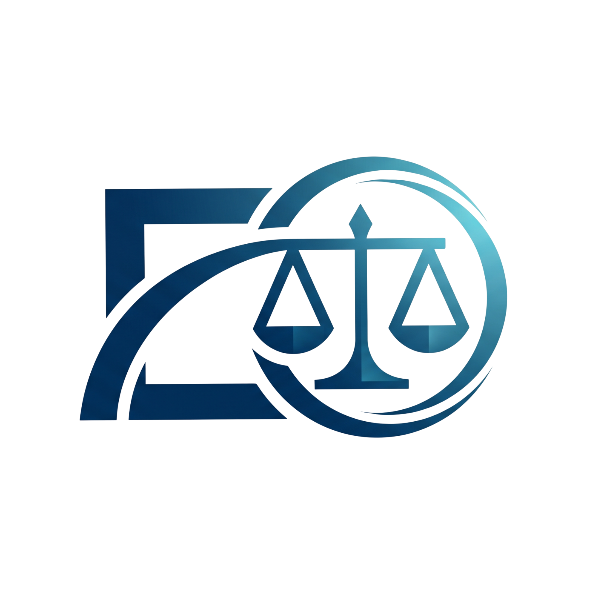

# 04 UI/UX og skjermkart

## Visuell identitet

Brand assets:

```text
assets\brand\logo.png
assets\brand\logo.ico
assets\brand\introvideo.mp4
evida-core\desktop-tauri\public\logo.png
evida-core\desktop-tauri\public\introvideo.mp4
```

Logo:



## Første skjerm

Introen er bevisst enkel:

```text
+--------------------------------------------------+
|                                                  |
|                 introvideo.mp4                   |
|                                                  |
|           Klikk hvor som helst for å gå inn       |
|                                                  |
+--------------------------------------------------+
```

Ingen login skal vises i lokal evaluation-build.

## Appskall etter intro

```text
+----------------------+-----------------------------------------------+
| Sidebar              | Workroom header / case context                |
|                      +-----------------------------------------------+
| + Ny sak             | Next action / readiness / import status       |
| Bytt sak             +-----------------------------------------------+
| Ny sak i nytt vindu  |                                               |
|                      | Active workroom                               |
| Arbeid               |                                               |
| - Saksoversikt       | Saksrom, Dokumenter, Dokumentkontroll, osv.   |
| - Dokumenter         |                                               |
| - Dokumentkontroll   |                                               |
| - Saksrom            |                                               |
|                      |                                               |
| Analyse              |                                               |
| - Kronologi          |                                               |
| - Bevismatrise       |                                               |
| - Anførsler          |                                               |
| - Motstrid           |                                               |
| - Risiko             |                                               |
| - Rettssimulering    |                                               |
|                      |                                               |
| Produksjon           |                                               |
| - Utkast             |                                               |
| - Eksport            |                                               |
+----------------------+-----------------------------------------------+
```

## Hovedflater

### Saksrom

Formål:

- primær arbeidsflate
- chat-first
- dokumentopplasting direkte i samtaleflaten
- svar med kilder, usikkerhet og neste steg

Kode:

```text
src/components/CaseRoomView.tsx
src/features/adaptiveSaksrom/
src/lib/answerQuality.ts
```

### Dokumenter

Formål:

- dokumentliste
- søk/filter
- importkø
- status per fil
- visning av ETA og antall ferdig/behandlet

Kode:

```text
src/App.tsx
src/components/ImportProgressSummary.tsx
src/features/documents/importUx.ts
```

### Dokumentkontroll

Formål:

- kontrollere dokumenter som ikke automatisk kan brukes fullt ut
- godkjenne som kildegrunnlag
- holde dokumenter utenfor saken
- se dokumenter som ikke ble brukt

Kode:

```text
src/App.tsx
src/features/documents/documentBasis.ts
src/components/DocumentPreviewDrawer.tsx
```

### Kontrollgrunnlag

Formål:

- teknisk og juridisk kontrollflate
- importhelse
- OCR
- dekning
- audit
- kildegrunnlag

Dette er mer "inspeksjon" enn første brukeropplevelse.

### Analyseflater

Arbeidsrom:

- Kronologi
- Bevismatrise
- Anførsler
- Motstrid
- Risiko
- Rettssimulering

Kode:

```text
src/components/workrooms/
```

## Viktige UI-regler

- Ikke vis teknisk dashboard som førsteopplevelse.
- Ikke vis 100 % komplett hvis grunnlaget fortsatt trenger kontroll.
- All importstatus må ha tydelig neste handling.
- Feil ved import skal gi trygg recovery-copy, ikke bare teknisk feilmelding.
- Modaler/drawers skal kunne lukkes med Escape og flytte fokus riktig.
- Sidebar skal vise låste flater tydelig, med årsak i tooltip/title.
- Ingen login i lokal evaluation-build.

## Styling

Global CSS:

```text
src/styles.css
```

Tema og workroom-farger:

```text
src/lib/workroomTheme.ts
```

Ikoner:

```text
lucide-react
src/components/WorkroomIcon.tsx
```

## Skjermbilder som bør finnes før ekstern overlevering

Legg faktiske skjermbilder i:

```text
utvikler-mappe\skjermbilder\
```

Minimum:

1. Intro
2. Tomt Saksrom
3. Dokumentimport i gang
4. Import ferdig med ETA/status
5. Dokumentkontroll
6. Saksrom med kildesvar
7. Kilde-/dokumentdrawer
8. Kontrollgrunnlag
9. En analyseflate
10. Eksport/vedlikehold
