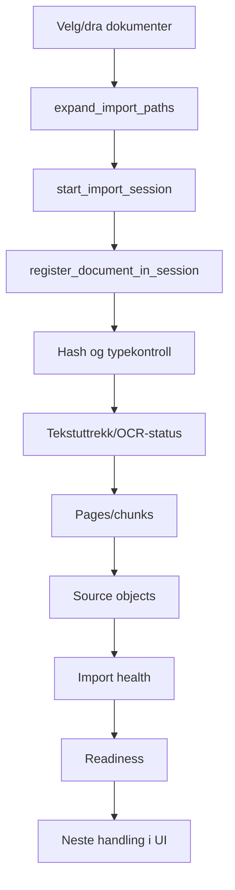

# 05 Data, API og importpipeline

## Lokal datalagring

Desktopappen bruker lokal SQLite:

```text
%LOCALAPPDATA%\Evida\evida.local.sqlite3
```

Kode:

```text
src-tauri/src/db.rs
```

## Viktige tabeller

Kjernetabeller:

- `cases`
- `documents`
- `pages`
- `chunks`
- `source_objects`
- `audit_events`

Import og kontroll:

- `import_sessions`
- `import_sources`
- `import_items`
- `import_jobs`
- `import_events`
- `import_verification_results`
- `case_readiness_reports`
- `extraction_results`
- `ocr_results`
- `manual_review_items`
- `manual_review_actions`
- `duplicate_groups`
- `citation_validation_results`

Analyse og Saksrom:

- `chronology_events`
- `evidence_items`
- `argument_items`
- `contradiction_items`
- `risk_items`
- `case_ai_sessions`
- `case_ai_messages`
- `case_ai_message_sources`

## Importpipeline



## Importstatus i UI

Frontendmodellen ligger i:

```text
src/features/documents/importUx.ts
```

Den lager:

- `ImportOutcome`
- `NextActionDecision`
- `ImportOutcomeViewModel`

Typiske neste handlinger:

- vent på import
- se importdetaljer
- kontroller dokumenter
- kjør OCR
- åpne foreløpig Saksrom
- åpne Saksrom

## API-broen

Frontend kaller:

```text
src/lib/api.ts
```

Derfra går kall til Tauri:

```text
invoke("command_name", args)
```

Rust-kommandoer registreres i:

```text
src-tauri/src/lib.rs
```

og implementeres i:

```text
src-tauri/src/commands.rs
```

## Kommandoområder

Saker:

- `create_case`
- `rename_case`
- `list_cases`
- `soft_delete_case`
- `mark_case_opened`
- `open_new_case_window`
- `open_case_window`

Import:

- `choose_document_paths`
- `choose_document_folder_paths`
- `expand_import_paths`
- `start_import_session`
- `complete_import_session`
- `register_document_in_session`
- `reindex_case_documents`
- `get_import_health`
- `list_import_items`
- `remove_import_item_from_case`

Kontroll:

- `list_manual_review_items`
- `apply_manual_review_action`
- `record_document_control_action`
- `list_ocr_results`
- `run_ocr_for_import_item`
- `refresh_evidence_quality`

Dokument/kilde:

- `list_documents`
- `list_source_objects`
- `search_sources`
- `open_original_folder`

Saksrom og analyse:

- `ask_case_ai`
- `record_case_ai_exchange`
- `list_case_ai_messages`
- `build_chronology`
- `build_evidence_matrix`
- `create_argument_item`
- `find_contradictions`
- `assess_risk`

Drift/eksport:

- `export_diagnostics`
- `export_import_diagnostics`
- `create_encrypted_backup`
- `restore_encrypted_backup`
- `reset_test_data`
- `get_database_security_status`

## Browser/dev fallback

I webmodus uten Tauri bruker `src/lib/api.ts` localStorage-fallback for en del funksjoner. Dette er nyttig for frontendutvikling, men er ikke samme sikkerhets- eller filsystemflate som desktopappen.
